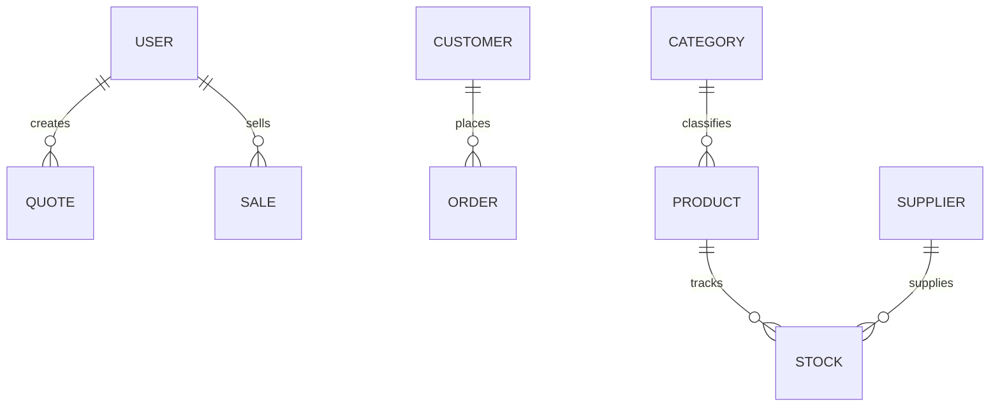

# Colori Systems Backend

## Descrição do Projeto

O Colori Systems Backend é um sistema robusto de controle e gestão de estoque, desenvolvido para otimizar as operações de negócios. Ele oferece funcionalidades abrangentes para gerenciamento de usuários, produtos, categorias, fornecedores, clientes, movimentações de estoque e geração de relatórios detalhados. A arquitetura do sistema é baseada em Node.js com Express.js, utilizando MongoDB como banco de dados, garantindo escalabilidade e flexibilidade.

## Funcionalidades Principais

O sistema Colori Systems Backend oferece as seguintes funcionalidades:

*   **Autenticação e Autorização**: Sistema de login seguro com JSON Web Tokens (JWT) e controle de acesso baseado em papéis (RBAC), permitindo diferentes níveis de permissão para usuários (administrador, operador, estoquista, gerente).
*   **Gestão de Usuários**: Criação, leitura, atualização e exclusão (CRUD) de usuários do sistema, com atribuição de papéis específicos.
*   **Gestão de Produtos**: CRUD completo para produtos, incluindo informações como nome, descrição, preço, quantidade em estoque e estoque mínimo.
*   **Gestão de Categorias**: Organização de produtos através de categorias, facilitando a busca e a gestão.
*   **Gestão de Fornecedores**: CRUD para informações de fornecedores, permitindo o registro e a consulta de dados essenciais.
*   **Gestão de Clientes**: CRUD para o cadastro de clientes, armazenando dados relevantes para operações comerciais.
*   **Controle de Estoque**: Registro detalhado de movimentações de entrada e saída de produtos, com atualização automática dos níveis de estoque. Identificação de produtos com estoque baixo.
*   **Geração de Relatórios**: Capacidade de gerar relatórios analíticos sobre vendas por período, vendas por produto, produtos com estoque baixo, lucro por período e vendas por vendedor. Os relatórios podem ser exportados para formatos como Excel.
*   **Validação de Dados**: Validação integrada para documentos brasileiros como CPF e CNPJ, além de CEP, garantindo a integridade dos dados.
*   **Documentação da API**: Preparado para documentação da API utilizando Swagger, facilitando a integração e o entendimento dos endpoints disponíveis.

## Tecnologias Utilizadas

As principais tecnologias e bibliotecas utilizadas no desenvolvimento deste backend incluem:

*   **Node.js**: Ambiente de execução JavaScript assíncrono e orientado a eventos.
*   **Express.js**: Framework web rápido e minimalista para Node.js, utilizado para construir a API RESTful.
*   **MongoDB**: Banco de dados NoSQL orientado a documentos, para armazenamento flexível de dados.
*   **Mongoose**: Modelagem de objetos MongoDB (ODM) para Node.js, simplificando a interação com o banco de dados.
*   **JSON Web Tokens (JWT)**: Padrão aberto para criação de tokens de acesso que permitem a autenticação e autorização de usuários.
*   **Bcrypt.js**: Biblioteca para hash de senhas, garantindo a segurança das credenciais dos usuários.
*   **CORS**: Middleware para habilitar o Cross-Origin Resource Sharing.
*   **Multer**: Middleware para Node.js que facilita o upload de arquivos.
*   **ExcelJS**: Biblioteca para ler, manipular e escrever dados em arquivos Excel (xlsx).
*   **jsPDF**: Biblioteca para gerar documentos PDF no lado do cliente.
*   **Swagger-jsdoc & Swagger-ui-express**: Ferramentas para gerar e servir a documentação interativa da API (OpenAPI/Swagger UI).

## Estrutura do Projeto

A estrutura de diretórios do projeto é organizada da seguinte forma:

```
ColoriSystems/
├── eslint.config.mjs
├── package-lock.json
├── package.json
├── seed/                  # Scripts para popular o banco de dados
│   └── admin.seed.js
└── src/                   # Código fonte da aplicação
    ├── app.js             # Configuração principal do Express
    ├── config/            # Configurações gerais (ex: Swagger)
    │   └── swagger.js
    ├── controller/        # Lógica de controle para as rotas
    │   ├── AuthController.js
    │   ├── CategoryController.js
    │   ├── CustomerController.js
    │   ├── ProductController.js
    │   ├── ReportController.js
    │   ├── StockController.js
    │   ├── SupplierController.js
    │   └── userController.js
    ├── middlewares/       # Middlewares para autenticação e autorização
    │   ├── authMiddleware.js
    │   └── roleMiddleware.js
    ├── migrations/        # Scripts de migração de banco de dados
    │   └── 001-init.js
    ├── models/            # Definições dos modelos de dados (Mongoose)
    │   ├── CategoryModel.js
    │   ├── ConnectionModel.js
    │   ├── CustomerModel.js
    │   ├── ProductModel.js
    │   ├── StockModel.js
    │   ├── SupplierModel.js
    │   └── UserModel.js
    ├── routes/            # Definição das rotas da API
    │   ├── v1/            # Rotas da versão 1 da API
    │   │   ├── auth.routes.js
    │   │   ├── category.routes.js
    │   │   ├── customer.routes.js
    │   │   ├── health.routes.js
    │   │   ├── index.js
    │   │   ├── products.routes.js
    │   │   ├── report.routes.js
    │   │   ├── stock.routes.js
    │   │   ├── supplier.routes.js
    │   │   └── user.routes.js
    │   └── v2/            # Rotas da versão 2 da API (vazia)
    ├── services/          # Lógica de negócio e serviços
    │   ├── AuthService.js
    │   ├── CategoryService.js
    │   ├── CustomerService.js
    │   ├── ProductService.js
    │   ├── ReportService.js
    │   ├── StockService.js
    │   ├── SupplierService.js
    │   └── userService.js
    ├── server.js          # Ponto de entrada do servidor
    └── utils/             # Utilitários e funções auxiliares
        └── validators/    # Validadores de documentos
            ├── ValidateCPF.js
            ├── validadeCEP.js
            └── validateCNPJ.js
```

## Como Rodar o Projeto

Para configurar e rodar o projeto localmente, siga os passos abaixo:

### Pré-requisitos

Certifique-se de ter as seguintes ferramentas instaladas em sua máquina:

*   Node.js (versão 14 ou superior)
*   npm (gerenciador de pacotes do Node.js)
*   MongoDB (servidor de banco de dados)

### Instalação

1.  **Clone o repositório** (se aplicável, ou descompacte o arquivo):

    ```bash
    git clone github.com/emerlly/ColoriSystems.git
    cd ColoriSystems
    ```

2.  **Instale as dependências**: Navegue até o diretório raiz do projeto e execute o comando:

    ```bash
    npm install
    ```

3.  **Configuração do Ambiente**: Crie um arquivo `.env` na raiz do projeto com as seguintes variáveis de ambiente:

    ```env
    PORT=3000
    MONGODB_URI=mongodb://localhost:27017/colorisystems_db
    JWT_SECRET=sua_chave_secreta_jwt
    ```

    *   `PORT`: Porta em que o servidor será executado (padrão: 3000).
    *   `MONGODB_URI`: URI de conexão com o seu banco de dados MongoDB.
    *   `JWT_SECRET`: Uma string secreta forte para assinar os tokens JWT.

### Execução

Para iniciar o servidor em modo de desenvolvimento (com `nodemon` para recarga automática):

```bash
npm run dev
```

Ou para iniciar o servidor em modo de produção:

```bash
npm start
```

O servidor estará disponível em `http://localhost:3000/api` (ou na porta configurada no `.env`).

# Seeds

### seed/admin.seed.js  
Script para criar usuário administrador. Conecta ao MongoDB, verifica existência do admin e, se ausente, insere um usuário com papel `admin`.  
- Conexão: `mongoose.connect(process.env.DATABASE_URL)`  
- Verificação: `User.findOne({ email: 'admin@admin.com' })`  
- Criação: `User.create({ name, cpf, email, password, role, active })`  

```js
// Trecho principal
const exists = await User.findOne({ email: 'admin@admin.com' });
if (!exists) {
  await User.create({
    name: 'userName',
    cpf: '0000000000',
    email: 'admin@admin.com',
    password: '123456',
    role: 'admin',
    active: true
  });
}
```

### seed/users.seed.js  
Popula usuários de teste (`seller`, `operator`, `customer`).  
- Hash de senha via **bcryptjs**  
- Insere múltiplos documentos em `users`  

```js
await User.deleteMany();
await User.create([
  { name: 'Vendedor', email: 'seller@colori.com', password, role: 'seller', cpf: '98765432100' },
  { name: 'Operador', email: 'operator@colori.com', password, role: 'operator', cpf: '45678912300' },
  { name: 'Customer', email: 'customer@colori.com', password, role: 'customer', cpf: '12345678900' }
]);
```

### seed/categories.seed.js  
Cria categorias iniciais (Xícaras, Copos, Garrafas).  
- Remove todas antes de inserir  
- Model: `CategoryModel`  

### seed/suppliers.seed.js  
Registra três fornecedores de exemplo com CNPJ.  

### seed/customers.seed.js  
Insere dois clientes com CPF.  

### seed/products.seed.js  
Popula produtos vinculados a categorias já criadas.  
- Busca categorias existentes  
- Insere produto com preço de venda, custo e estoque  

### seed/stock.seed.js  
Gera movimentação de saída em estoque com base em uma venda.  
- Usa modelos `SaleModel` e `ProductModel`  

### seed/sales.seed.js  
Cria venda a partir de um orçamento (`QuoteModel`).  

### seed/budgets.seed.js  
Gera orçamento inicial:  
- Busca produto e cliente por ID  
- Insere orçamento com itens e valor total  

### seed/order.seed.js  
[Em branco/placeholder] possivelmente para pedidos futuros.  

### seed/index.js  
Orquestra execução de todos os scripts acima em sequência.  

---

# Configurações

### src/config/mercadopago.js  
Configura o SDK de MercadoPago com o token de acesso via variável de ambiente.  
```js
const mercadopago = require('mercadopago');
mercadopago.configurations.setAccessToken(process.env.MERCADOPAGO_ACCESS_TOKEN);
module.exports = mercadopago;
```

### src/config/swagger.js  
Inicializa o **Swagger JSDoc** para gerar documentação OpenAPI a partir dos comentários nas rotas.  
- Define `openapi: '3.0.0'`, informações, servidores e segurança JWT  
- Varre `routes/v1/*.js` em busca de anotações  

```js
const options = {
  definition: { /* info, servers, components */ },
  apis: ['../../routes/v1/*.js']
};
module.exports = require('swagger-jsdoc')(options);
```

---

# Componentes Swagger

### src/componets/swagger/userRoutes.swagger.js  
Define esquema OpenAPI para modelo `User`.  
```yaml
components:
  schemas:
    User:
      type: object
      properties:
        id:
          type: string
        name:
          type: string
        email:
          type: string
```

---

# Middlewares

### src/middlewares/authMiddleware.js  
Valida JWT enviado em `Authorization: Bearer <token>`.  
- Decodifica token com `jsonwebtoken`  
- Anexa `req.user` com `id`, `role`, `companyId`  
- Bloqueia acesso quando ausente ou inválido  

### src/middlewares/roleMiddleware.js  
Verifica se `req.user.role` está entre os perfis autorizados.  
- Recebe lista ou valor único  
- Retorna **403 Forbidden** em falta de permissão  

---

# Controllers

Cada *Controller* recebe requisição HTTP, chama o **Service** correspondente e envia resposta JSON.

### src/controller/AuthController.js  
- `login(req, res)`: autentica e retorna JWT + dados do usuário  
- `register(req, res)`: cadastra novo usuário (papel `admin` somente)  

#### POST /auth/login  
```api
{
  "title": "Login do Usuário",
  "description": "Autentica usuário e retorna token JWT",
  "method": "POST",
  "baseUrl": "http://localhost:3000/api",
  "endpoint": "/auth/login",
  "bodyType": "json",
  "requestBody": "{\n  \"email\": \"user@example.com\",\n  \"password\": \"123456\"\n}",
  "responses": {
    "200": {
      "description": "Autenticação bem-sucedida",
      "body": "{\n  \"token\": \"<jwt>\",\n  \"user\": { \"id\": \"\", \"name\": \"\", \"email\": \"\", \"role\": \"\" }\n}"
    },
    "401": {
      "description": "Credenciais inválidas",
      "body": "{ \"message\": \"Credenciais inválidas\" }"
    }
  }
}
```

#### POST /auth/register  
```api
{
  "title": "Registro de Usuário",
  "description": "Insere novo usuário (admin somente)",
  "method": "POST",
  "baseUrl": "http://localhost:3000/api",
  "endpoint": "/auth/register",
  "headers": [
    { "key": "Authorization", "value": "Bearer <token>", "required": true }
  ],
  "bodyType": "json",
  "requestBody": "{\n  \"name\": \"João\",\n  \"email\": \"joao@example.com\",\n  \"password\": \"senha123\",\n  \"role\": \"operator\",\n  \"cpf\": \"12345678900\"\n}",
  "responses": {
    "201": {
      "description": "Usuário criado",
      "body": "{ \"message\": \"Usuário criado com sucesso\" }"
    },
    "400": {
      "description": "Dados inválidos",
      "body": "{ \"message\": \"E-mail já cadastrado\" }"
    }
  }
}
```

> Os demais Controllers (`Category`, `Customer`, `Dashboard`, `Payment`, `Product`, `Quote`, `Report`, `Sale`, `Stock`, `Supplier`, `order`, `user`) seguem padrão similar:
> - Métodos CRUD/ação (`create`, `getAll`, `getById`, `update`, `delete`, ações específicas como `approveQuote`, `salesByPeriod` etc.)  
> - Lance erros tratados em `try/catch` e retornam códigos HTTP adequados.  

---

# Migrations

### src/migrations/001-init.js  
Define modelos iniciais e coleções no MongoDB (usuários, categorias, produtos etc.).

### src/migrations/002-order.js  
Adiciona estrutura para pedidos (`OrderModel`), relacionando com clientes e itens.

### src/migrations/migrateTenant.js  
Script de migração multi-tenancy; repassa dados para diferentes **tenants** quando aplicável.

---

# Models

Cada arquivo em `src/models` exporta esquema Mongoose e modelo.

- **CategoryModel.js**: `name`, `description`, timestamps.  
- **CompanyModel.js**: informações da empresa (para multi-tenant).  
- **ConnectionModel.js**: controla conexões dinâmicas a bancos de dados.  
- **CustomerModel.js**: `name`, `cpf`, contato, `active`.  
- **DashboardCacheModel.js**: cache de relatórios para performance.  
- **OrderModel.js**: referencia `Customer`, `createdBy` (usuário), `items` e valores.  
- **ProductModel.js**: `code`, `name`, `category`, `costPrice`, `salePrice`, estoque e flags.  
- **QuoteModel.js**: orçamento, itens, total, status (`draft`, `approved` etc.)  
- **SaleModel.js**: vendas finais, método de pagamento, referências a `Quote` e `Customer`.  
- **StockModel.js**: movimentações de estoque (`in`, `out`, ajustes), vinculado a produto, usuário, fornecedor/cliente.  
- **SupplierModel.js**: `name`, `cnpj`, contato.  
- **UserModel.js**: esquema de usuário com hooks para hash de senha e método `.comparePassword`.  



---

# Rotas (v1)

O roteador principal (`src/routes/v1/index.js`) monta sub-routers:

- **/auth** → `auth.routes.js`  
- **/products** → `products.routes.js`  
- **/categories** → `category.routes.js`  
- **/suppliers** → `supplier.routes.js`  
- **/customers** → `customer.routes.js`  
- **/stock** → `stock.routes.js`  
- **/reports** → `report.routes.js`  
- **/health** → `health.routes.js`  
- **/users** → `user.routes.js`  
- **/sales** → `sale.routes.js`  
- **/quotes** → `quote.routes.js`  
- **/orders** → `order.routes.js`  

Cada arquivo de rotas importa o Controller correspondente e aplica `auth` e `authorize` conforme necessidade de papel.

---

# Serviços

Em `src/services`, a lógica de negócio está centralizada:

- **AuthService**: login (`jwt.sign`), registro de usuário.  
- **CategoryService**: CRUD de categorias.  
- **CustomerService**: valida CPF, gerencia clientes.  
- **DashboardService**: agrega métricas (resumo, top produtos, alertas).  
- **MPaymentService** & **PaymentService**: integração MercadoPago e controle de pagamentos.  
- **ProductService**: validações de produto e busca.  
- **QuoteService**: criação, aprovação, cancelamento e conversão de orçamentos.  
- **ReportService**: gera relatórios, Excel via **ExcelJS**, PDF via **jsPDF**.  
- **SaleService**: processa venda, calcula totais e atualiza estoque via `StockService`.  
- **StockService**: registra movimentações, consulta histórico e status.  
- **SupplierService**: CRUD de fornecedores.  
- **orderService**: lógica relacionada a pedidos (futuro).  
- **userService**: busca, atualização e desativação de usuários.  

---

# Utilitários

Validadores para documentos brasileiros em `src/utils/validators`:

- **ValidateCPF.js**: verifica CPF  
- **validateCNPJ.js**: verifica CNPJ  
- **validadeCEP.js**: formata/valida CEP  

---

# Arquivos Principais

### src/app.js  
Configura Express:  
- Middlewares: `cors()`, `express.json()`  
- Swagger UI em `/api/docs`  
- Monta roteador `app.use('/api', router)`  

### src/server.js  
Inicia servidor na porta definida em `.env` ou 3000.  

```bash
node src/server.js
```

```mermaid
flowchart TD
  Cliente -->|HTTP| Rota[/api/...]
  Rota --> Auth[authMiddleware]
  Auth --> Role[roleMiddleware]
  Role --> Controller
  Controller --> Service
  Service --> Model
  Model --> MongoDB[(MongoDB)]
```

---

Este conjunto de arquivos compõe o backend completo, onde cada camada (rota, middleware, controller, service, model) interage de forma organizada. Os **seeds** auxiliam no pré-carregamento de dados; as **migrations** estruturam o banco; os **models** definem o esquema; os **services** contêm a regra de negócio; os **controllers** orquestram requests e responses; e os **routes** expõem a API RESTful, documentada via **Swagger**.

**Desenvolvido por**: ColoriSystems
**Data**: 11 de janeiro de 2026
